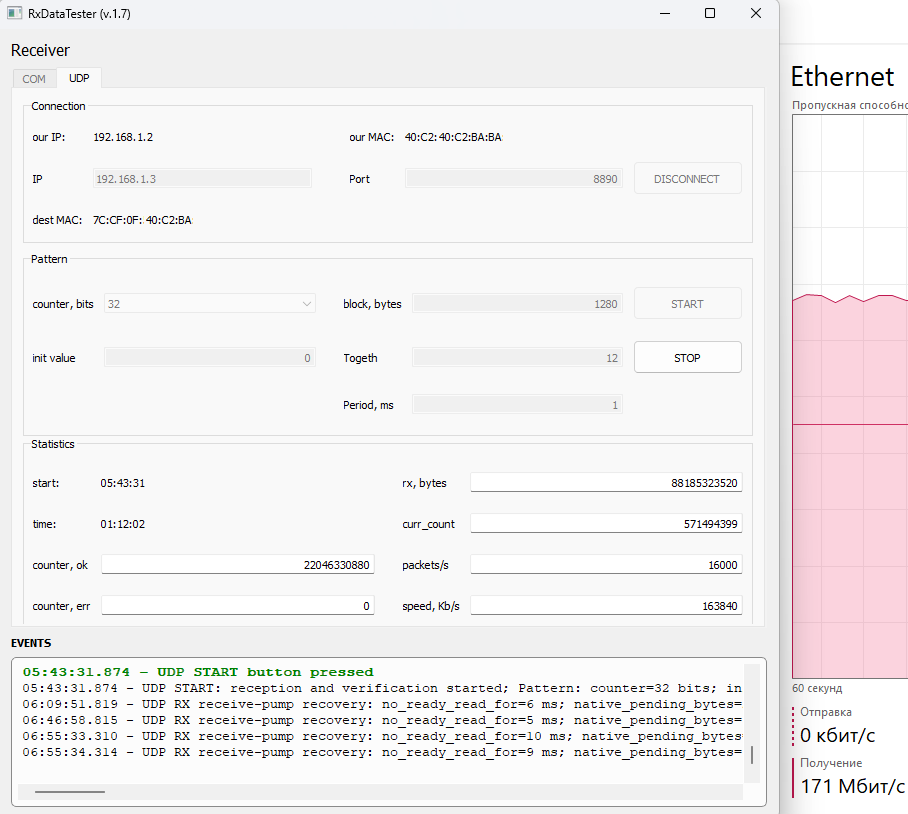

# TxRxDataTester

TxDataTester and RxDataTester generate, receive, and verify data patterns, such as continuous counters, for testing:

* USB-to-UART and USB-to-RS-485 adapters;
* LAN-to-UART and LAN-to-RS-485 adapters;
* UDP network connections;
* custom MCU and FPGA-based devices.

When selecting a new communication adapter, it is often necessary to verify whether it loses data under a continuous high-rate data stream.

Custom devices based on microcontrollers or FPGAs also require long-duration testing with automatic verification of the received data.

TxDataTester and RxDataTester were developed for these purposes.

## Platform

* C++ / Qt 5.12
* Windows 7 and Windows 10

## Results

* Stable COM port testing at baud rates up to 921600 baud.
* Stable UDP testing at data rates up to 160 Mbit/s.

## To Do

* Test and verify operation on Linux.
* Add reading and writing of files containing counter patterns.
* Increase the maximum UDP data rate.
* Add commonly used predefined test scenarios.

## How to Use

Install Qt Creator, extract the required DLL files into the same directory as the executable file and run the application.

Complete application release packages will be published later.

## Examples

### Testing USB-to-RS-485 adapters for data loss

### Generating a continuous stream of UDP packets with a counter

### Receiving a continuous stream of UDP packets with a counter

