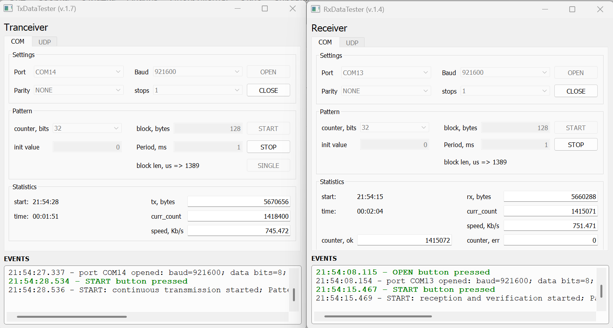
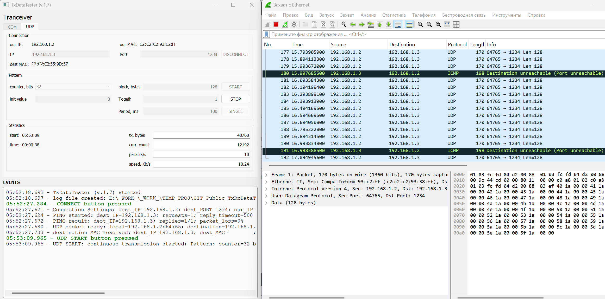

# TxRxDataTester
TxDataTester and RxDataTester generate, receive, and compare data patterns, such as continuous counters, for testing USB-UART(RS485), LAN-UART(RS485), and UDP network connections.

## Examples

### Testing USB-to-RS-485 adapters for data loss

### Generating a continuous stream of UDP packets with a counter

